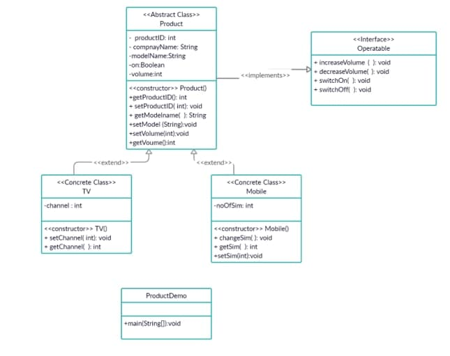
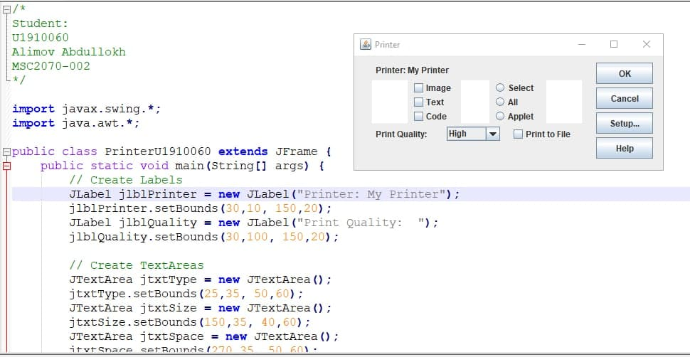
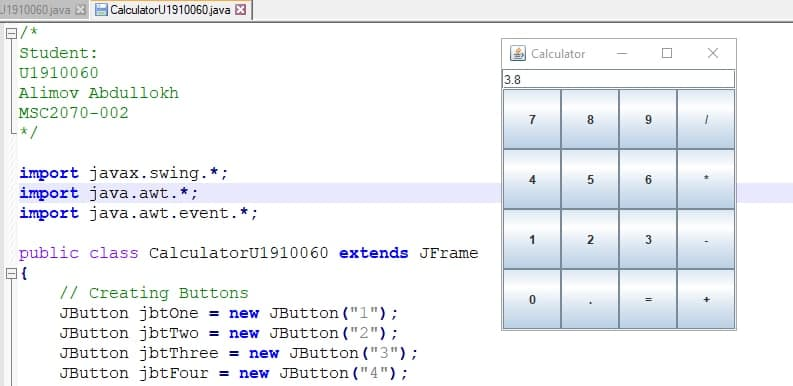
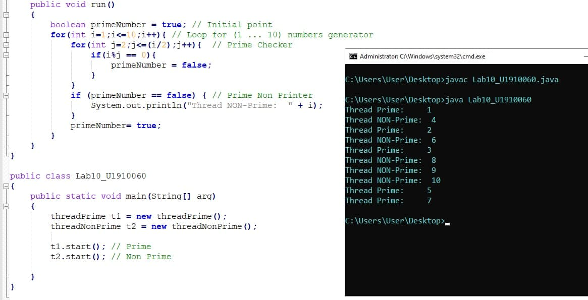

# Java-Projects ☕️
Learning Java and creating Projects 
Inha University Sophomore year (Application Progrmming in Java) 2020 Fall Semester 🏫🎓

### Programs:
    # 1 BMI Calculator 🧮
    - By recent estimates, two-thirds of the people in the United States are overweight 
    and about half of those are obese. 
    This causes significant increases in illnesses such as diabetes and heart disease. 
    To determine whether a person is overweight or obese, 
    you can use a measure called the body mass index (BMI). 
    
    # 2 MobileTest 📱
    - Write java program to create two classes Mobile and MobileTest. 
    
    Mobile class contains data fields company (e.g. Samsung, Nokia,…etc), model (J1, A1, X1…etc), 
    On (true or false), memory , hasCamera (true or false) and volume(range from 0 -10) and methods   
    two constructors ( one no argument and another with arguments), switchOn(), switchoff(), increaseVolume(), 
    decreaseVolume() and get and set methods for each data fields (getCompany(), setCompany(), 
    getModel(), setModel()……etc)
    
    MobileTest class will contains one method main(). In  main method  create object of 
    Mobile and write menu driven program to input mobile details, display mobile details, 
    change volume and  switch on or off mobile
    
    # 3 DoM Application ☀️☔️❄️
    - Department of Meteorology (DoM) has decided to develop application (DoM_Application) to 
    record year wise climatic information of cities in country.
    Functional requirements of DoM_Application are as follows:
    
    Menu driven Java program to implement DoM_Application using following class diagram.
    Menu must have following options.
     1. Maintain city wise hourly (00:00  to 23:00 ) temperature information.
     2. Maintain city wise yearly (from January to December) rainfall information.
     3. Display yearly climate data for city.
     
    # 4 Product Demo Application 📺📲
    Topics covered: Abstract Class, Interface & Polymorphism
    
    - Write Java Program to implement following class diagram. 
    In main method of ProductDemo class you have demonstrate polymorphism. 
    
    Special Instructions-
     1.	Program should be well commented.
     2.	Program should be easy to use.
     3.	Data Validation should be done. 
     e.g. channel range (1-100), volume range (0-10), product should be 
     on when you change volume or channel or sim change
     4.	Add necessary constructors, attributes and member functions if required.
     
     UML Diagram:
     
   
   
    # 5 Printer GUI JAVA Swing Apllication 🖨
    - GUI Design, No functionality 
    
   
     
    # 6 Calculator GUI JAVA Swing Apllication 📱
    - GUI Design with functionality 
    
   
   
    # 7 IUT BMI (MySQL database connection) 📅
    Create database IUT_BMI (using any database MySQL/Ms-Access/…). Create table given below.
    Database Name	IUT_BMI
    Table Name	Employee_BMI
    Columns	employeeID	
        employeeName	
        employeeHeight	
        employeeWeight	
        
    Write menu driven java program to Insert record / Delete record/ Display Record / Update.

    
    #8 Threads  👨‍👨‍👧‍👦
    1.	Write java program to implement two threads such that one thread prints prime numbers 
    from 1 to 10 and other thread prints non-prime numbers from 1 to 10. 
    Note :- Each thread has a delay of 500 millsecond after printing one number

   

